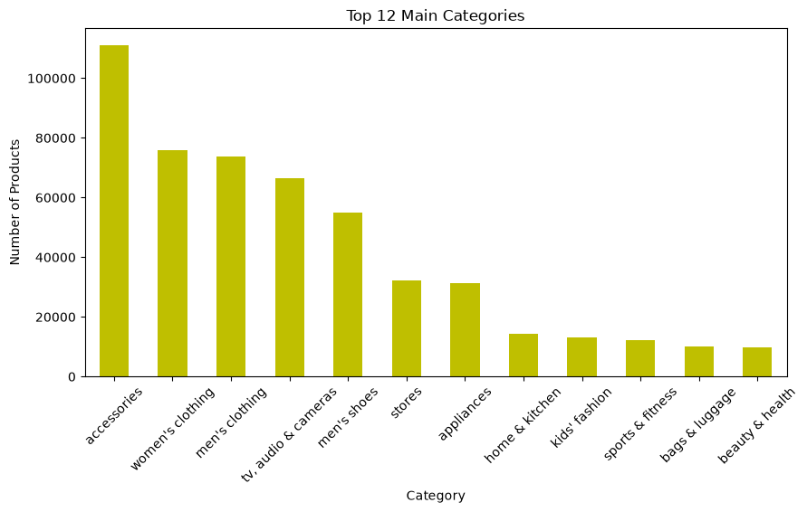
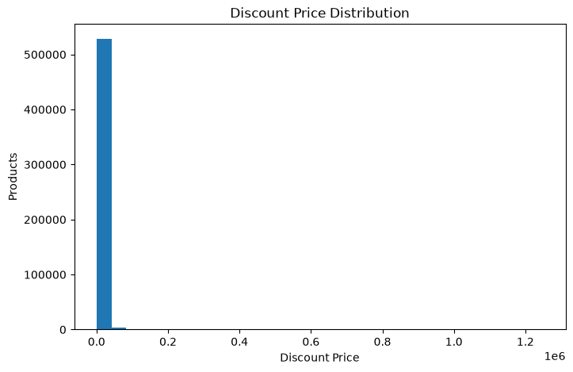
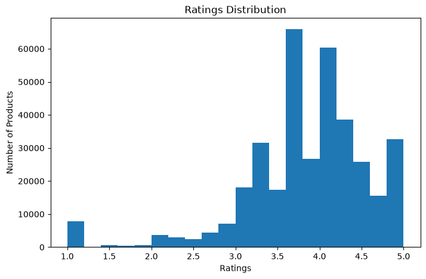
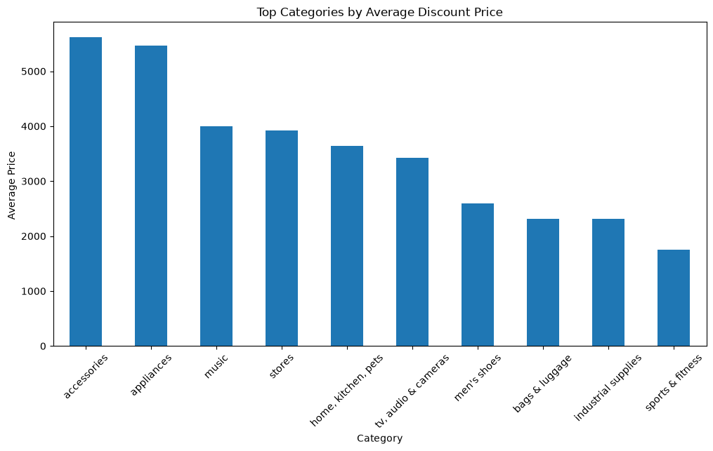
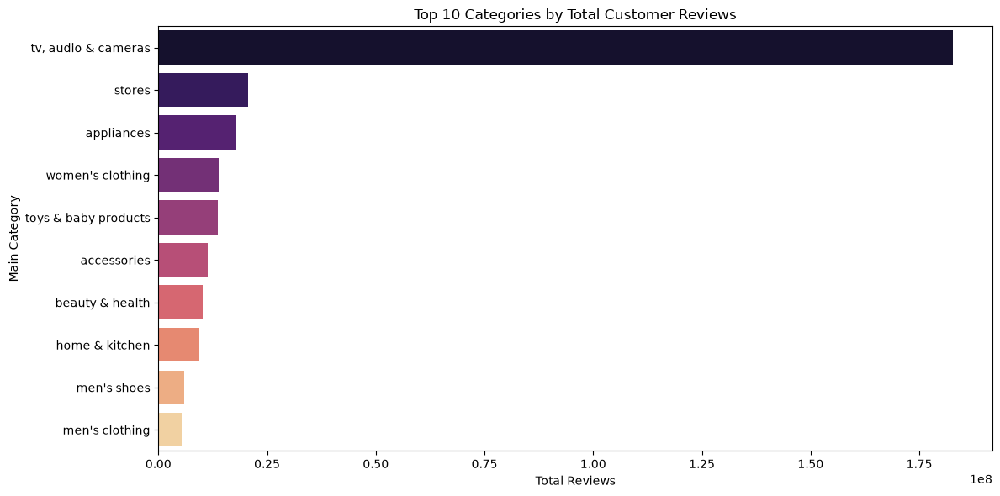
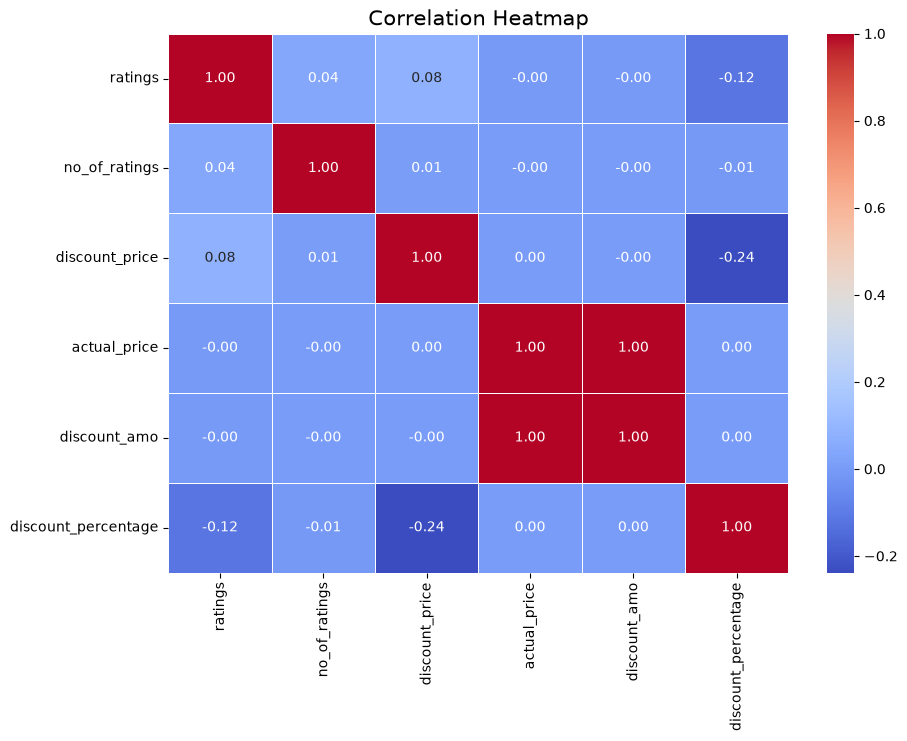

# Amazon Products Data Analysis

> Exploratory Data Analysis of 300K+ Amazon products using Python, Pandas, Matplotlib and Seaborn.

## 📌 Overview

This project analyzes a large real-world Amazon products dataset to understand product categories, pricing, discounts, customer ratings, and customer engagement.

The goal is to transform raw e-commerce data into meaningful insights that can help understand marketplace trends and product performance.

---

## 🔍 What I Analyzed

- Product distribution across categories and sub-categories
- Product pricing and price segments
- Discount amount and discount percentage
- Customer rating distribution
- Highly rated and highly reviewed products
- Customer review engagement
- Category-wise pricing and discounts
- Relationship between price and ratings
- Correlation between numerical variables
- Price outliers and distribution patterns

---

## 🛠️ Tech Stack

| Technology | Usage |
|------------|-------|
| Python | Data analysis |
| Pandas | Data manipulation & cleaning |
| NumPy | Numerical operations |
| Matplotlib | Data visualization |
| Seaborn | Statistical visualization |
| Jupyter Notebook | Analysis & documentation |

---

## 📊 Key Analysis Areas

### Product Analysis
Identified the most common product categories and sub-categories to understand where product listings are concentrated.

### Price Analysis
Analyzed actual prices, discounted prices, price segments, price distributions, and expensive products.

### Discount Analysis
Calculated:

**Discount Amount**

`Actual Price - Discount Price`

**Discount Percentage**

`(Discount Amount / Actual Price) × 100`

### Rating & Review Analysis
Analyzed customer ratings and review counts to identify products with strong customer engagement and understand rating patterns.

### Relationship Analysis
Explored relationships between:

- Price and ratings
- Discounts and pricing
- Ratings and customer reviews
- Other numerical variables using correlation analysis

---

## 💡 Business Insights

The analysis helps answer questions such as:

- Which product categories have the most listings?
- Which categories receive the highest customer engagement?
- What price segments dominate the marketplace?
- Which categories offer higher average discounts?
- Do expensive products necessarily receive better ratings?
- Which products have strong ratings along with significant customer reviews?

These insights can help sellers and businesses understand pricing, competition, promotions, and customer preferences.

---

## 📊 Project Visualizations

### Product Category Analysis



### Price Segment Distribution



### Rating Distribution



### Discount Analysis



### Customer Rating Activity



### Correlation Analysis



---

## 📈 Visualizations

Some of the visualizations included in the project:

- Top Product Categories
- Top Sub-Categories
- Price Distribution
- Discount Amount Distribution
- Rating Distribution
- Price Category Distribution
- Rating Category Distribution
- Average Rating by Category
- Average Discount by Category
- Most Reviewed Products
- Highest Rated Products
- Price vs Rating
- Discount Price Outliers
- Correlation Heatmap
- Total Customer Reviews by Category

---

## 🧹 Data Preparation

The dataset was prepared for analysis through:

- Removing unnecessary columns
- Checking duplicate records
- Handling missing values
- Converting prices into numerical values
- Converting ratings and review counts into appropriate data types
- Creating additional analytical features

### Engineered Features

- `discount_amount`
- `discount_percentage`
- `price_category`
- `rating_category`

---

## 📂 Dataset

**Amazon Products Dataset 2023**

The dataset contains **300K+ Amazon product records** collected across multiple product categories.

The original dataset is **not included in this repository** because of its large size.

### Source

[Kaggle — Amazon Products Dataset 2023](https://www.kaggle.com/datasets/lokeshparab/amazon-products-dataset)

To reproduce the analysis, download the dataset and place:

```text

Download the dataset from Kaggle and place it at:
Amazon-Products.csv